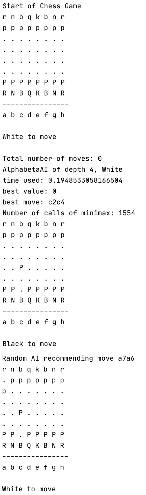

## WELCOME TO CHESS!

#### Zitong Wu, Oct. 2020

   

A chess program that allows one to play against a chess A.I. or to have two chess A.I.s play against each other.

Chess A.I. options:
* RandomAI: randomly makes a move
* MinimaxAI: employs the minimax algorithm for adversarial search 
* AlphabetaAI: uses alpha-beta tuning on top of the minimax algorithm to make the search faster
* Iterative_Deepening_AI: applies iterative deepening search on top of the alphabeta-minimax to better record the best move at each search depth

## Instructions

1. In test_chess.py, create a player by specifying the type (MinimaxAI, AlphabetaAI, or Iterative_Deepening_AI), the search depth, and the color. 
For example, to create an AlphabetaAI with a search depth of 3 playing white:    
player_alphabeta_3_white = AlphaBetaAI(3, chess.WHITE)

1. To set up a game, pass the players in ChessGame(player1, player2). Make sure that the white player is passed as the first argument and the black player as the second argument. 
For example, game = ChessGame(player_alphabeta_3_white , player_alphabeta_1_black)

3. To set a board position, pass a fen string to game.board.set_board_fen. 
For example, game.board.set_board_fen(“rnbqkbn1/ppppppp1/8/7p/1PPPPP2/4r3/P5PP/RNBQKBNR")

4. The prints the player information, the best move and its evaluation value, and the result of the game. 

5. Avoid search beyond depth 5, as it takes a very long time.

## Examples
  
...
  
