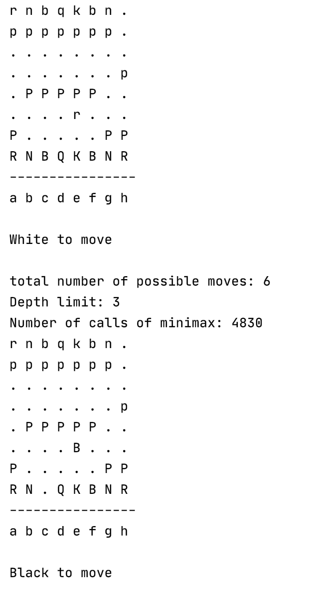
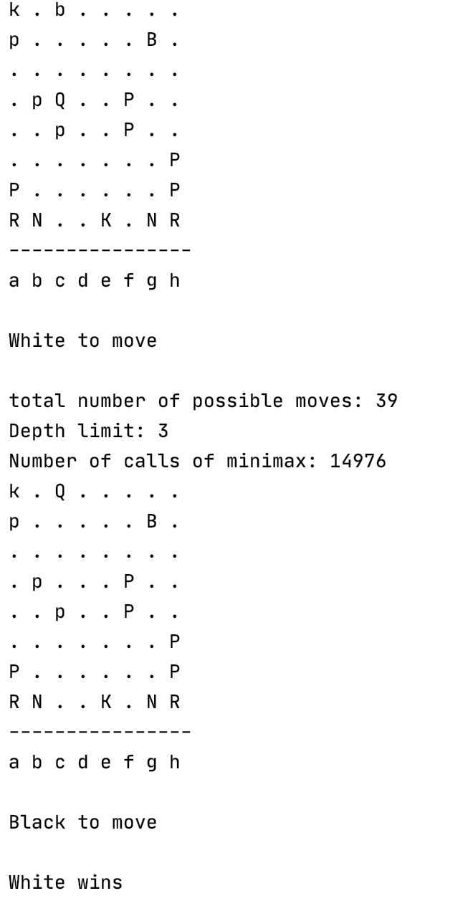
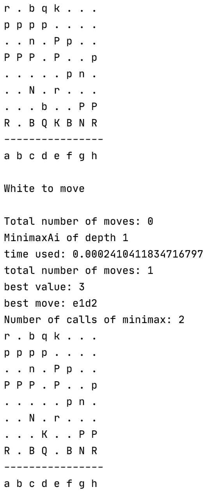
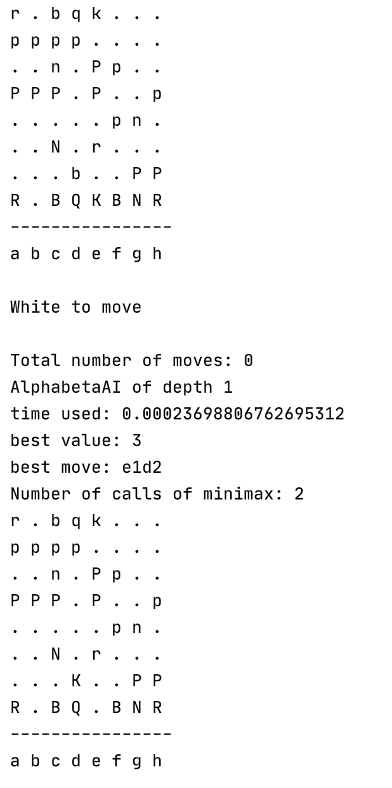
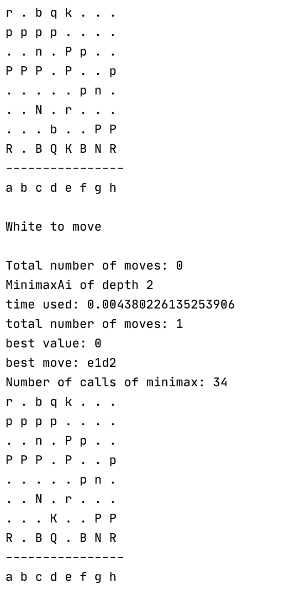
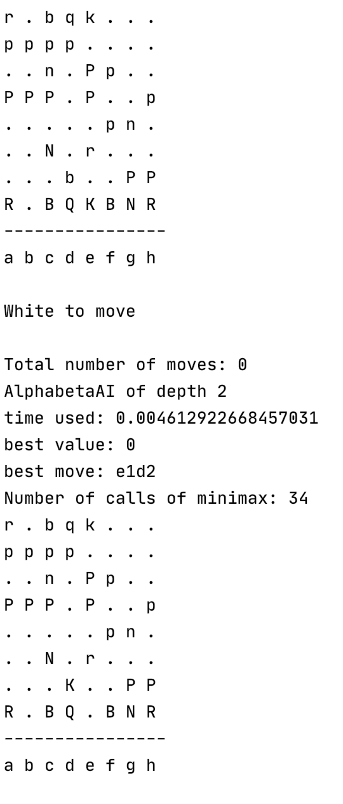
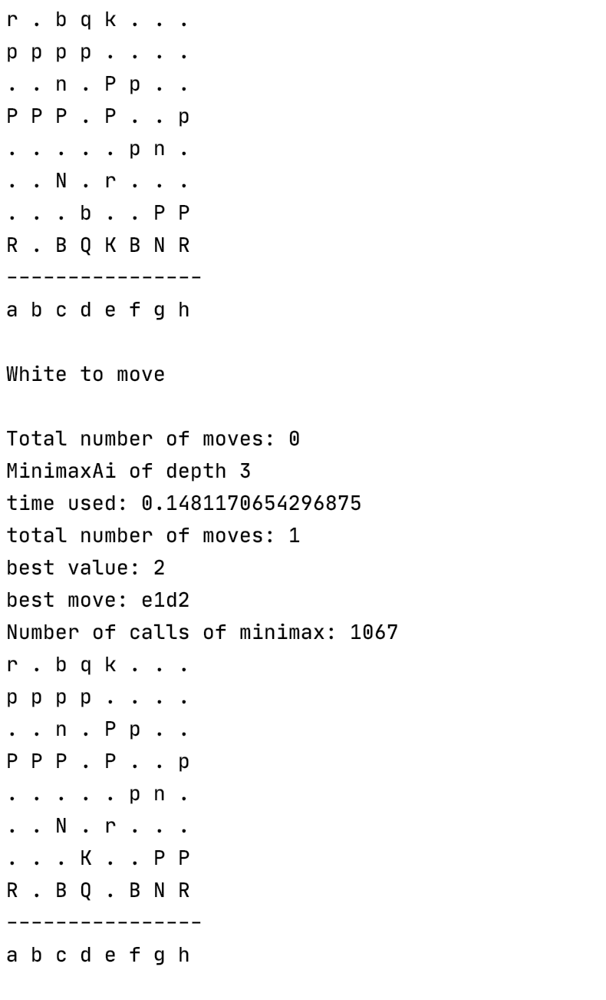
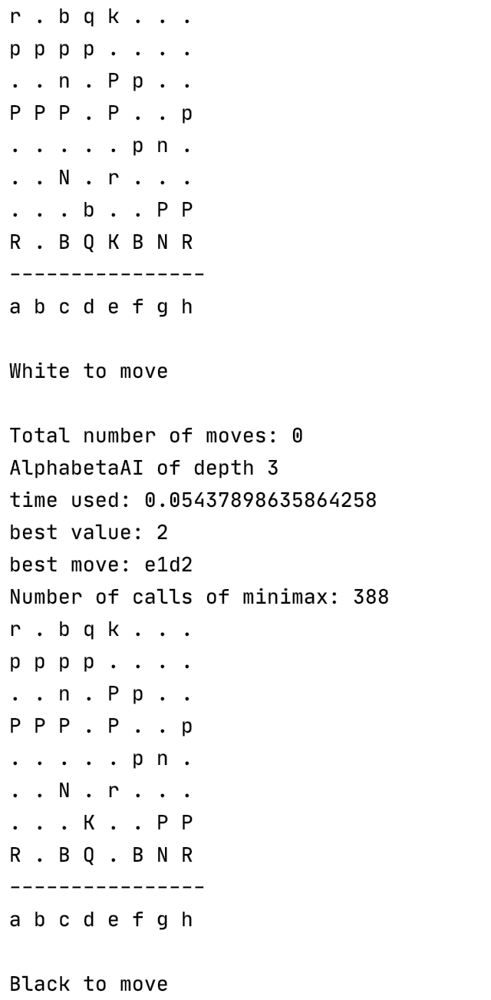
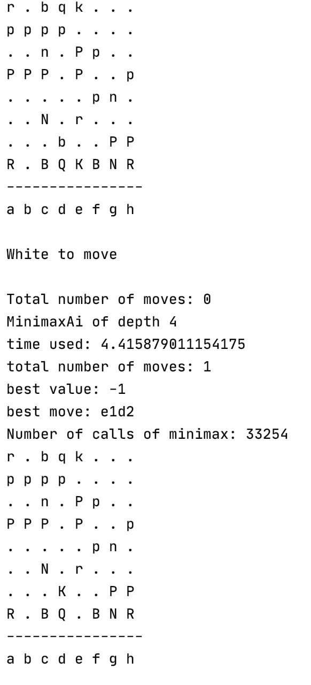
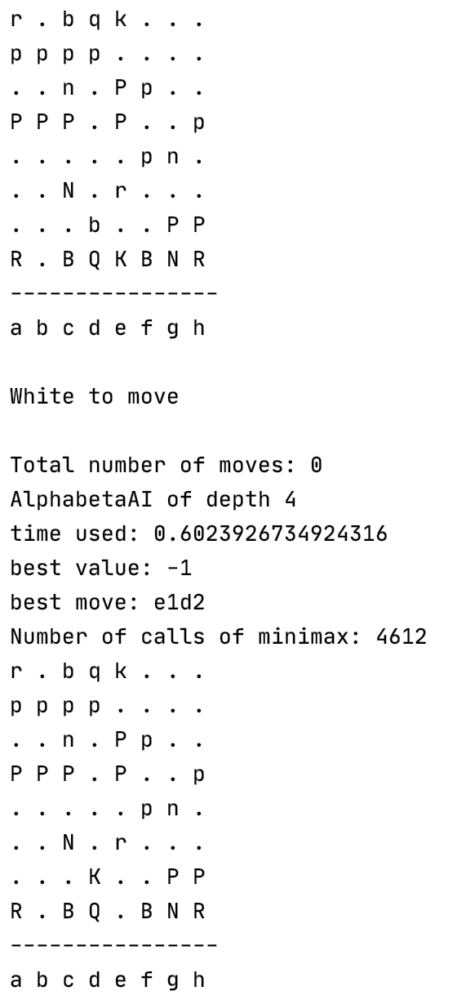

#### Author: Zitong Wu
Date: Oct 9, 2020

&nbsp;

# Chess A.I. Report
&nbsp;

## Description
1. The minimax algorithm is a recurisve depth first search algorithm. It works by calling the `max_value` and `min_value` functions in turn. The `max_value` function represents the player that tries to maximizes its score and the `min_value` function represents the player that tries to minimize the score of its opponent. The utility function is called when the search reaches the terminal state. Alpha-beta pruning helps cut unpromising subtrees. The alpha value keeps track of the best value found so far for the max player, and the beta value keeps track of the best value found so far for the min player (from the perspective of the min player). In alpha-beta minimax search, we replace the terminal test with the cutoff test to reduce the search depth, and replace the utility function with the evaluation function that returns an estimate of the true utility value.

2. Other than following the algorithm, the most critical design decision is random shuffling the legal moves at the beginning of the minimax search. Without doing this, the minimaxAI will choose repeated moves and the game will just go on and on and end in a draw. 

&nbsp;

## Evaluation
The implemented alpha-beta minimax algorithm works well. For example, an alphabetaAI of depth 3 always beats an alphabetaAI of depth 1 in 50 moves on average. For another example, an alphabetaAI of depth 3 always beats a randomAI in 50 moves on average as well (based on the test results from `test_average_performace.py`).

&nbsp;

## Discussions

### Minimax and Cutoff Test
1. At search depth 1, a minimaxAI takes around 0.005 second to find the best move and makes 25-30 calls to the minimax function.   
2. At search depth 2, a minimaxAI takes around 0.1 second to find the best move and makes 250-1000 calls to the minimax function.    
3. At search depth 3, a minimaxAI takes around 2 seconds to find the best move and makes 10000-350000 calls to the minimax function.    
4. At search depth 4, a minimaxAI takes around 30 seconds to find the best move and makes more than 200000 calls to the minimax function. This is already taking too long.

&nbsp;

### Evaluation Function
1. Theevaluation functions consists of two parts. The first part sums the material values of the pieces left for the minimaxAI minus the material values of the pieces left for the opponent. The second part adds a high value (100) to the evaluation value if the minimaxAI checkmates the opponent, or it substracts a high value(100) from the evaluation function if the minimaxAI is checkmated by the opponent.
2. With the evaluation function, the minimaxAi is now hard to beat. I created the following board position and had a minimaxAI of depth 3 (white) play against a minimaxAI of depth 1 (black). In this board position (fen string = rnbqkbn1/ppppppp1/8/7p/1PPPPP2/4r3/P5PP/RNBQKBNR), the black is checking the white. But the white successfully blocks this check by capturing the black rook with the white bishop.   
   
The following shows the end of this game. The white correctly chooses the move that checkmates the black king with the white queen.
 

3. A minimaxAI takes a long time to search a move, so I use alphabetaAI instead to test different depth limits. As mentioned above, I wrote a simple program in  `test_average_perfomance.py` that can test 20 trials of a game and output the average number of moves for the game. Here's the result: 
   * AlphabetaAI of depth 2 vs. alphabetaAI of depth 1: the total number of moves for a game is about 65.  
   * AlphabetaAI of depth 3 vs. alphabetaAI of depth 1: the total number of moves for a game is about 50.  
   * AlphabetaAI of depth 4 vs. alphabetaAI of depth 1:
the total number of moves for a game is also about 50.  
   * As we can see, having the same opponent alphabetaAI of depth 1, an alphabetaAI of depth 3 ends a game faster than an alphabetaAI of depth 2. However, an alphabetaAI of depth 4 does not end a game faster than the alphabetaAI of depth 3. They have about the same performance according to my test. It may be because the evaluation function employed is still very elementary. When the evalutive power is limited, no matter how much deeper the search goes, the overall performance will be limited.

&nbsp;
 
### Alpha-Beta Pruning
1. With alpha-beta pruning, it takes less time to search for a move. It can now search to depth 5.  
   * An alphabetaAI of depth 3 now takes only 0.5 second to find the best move, while a minimaxAI of depth 3 takes 2 seconds to find the best move. 
   * An alphabetaAI of depth 4 now takes only 1-10 seconds to find the best move, while a minimaxAI of depth 4 takes 30 seconds to find the best move.
   * An alphabetaAI of depth 5 takes 10-30 seconds to find the best move, while a minimaxAI of depth 5 takes much longer time to find the best move (I didn't wait until it found the move).
   * Depth 5 is about the limit of an alphabetaAI with random shuffling the list of legal moves at the beginning of the search.

2. Given the same **initial board position** and the same depth limit, the minimaxAI and the alphabetaAI each returns a move with the same value, and the alphabetaAI always accomplishes the same by exploring equal or fewer number of nodes (see the "Number of calls of minimax" in the printout) than the minimaxAI. For the following board position (fen string: r1bqk3/pppp4/2n1Pp2/PPP1P2p/5pn1/2N1r3/3b2PP/R1BQKBNR), I tested minimaxAI and alphabetaAI of depth 1, 2, and 3. 
   * Both minimaxAI and alphabetaAI of depth 1 give a move with value 3. Both explore two nodes (2 calls to the minimax function).  
  
   
   * Both minimaxAI and alphabetaAI of depth 2 give a move with value 0. Both explore 34 nodes (34 calls to the minimax function).  
  
  
   * Both minimaxAI and alphabetaAI of depth 3 gives a move with value 2. The minimaxAI explores 1067 nodes (1067 calls to the minimax function), whereas the alphabetaAI only explores 388 nodes (388 calls to the minimax function).  
  
  
   * Both minimaxAI and alphabetaAI of depth 4 gives a move with value -1. The minimaxAI explores 33254 nodes (33254 calls to the minimax function), whereas the alphabetaAI only explores 4612 nodes (4612 calls to the minimax function).  
   
   

&nbsp;

### Iterative Deepening
For the following board position (fen number: rb1qk3/pPpp4/4Pp2/P1P1n2p/5pn1/2b1B3/6PP/R1BQK1NR), the iterative deepening search at different depth gives different best move suggestions and different evaluation values. 